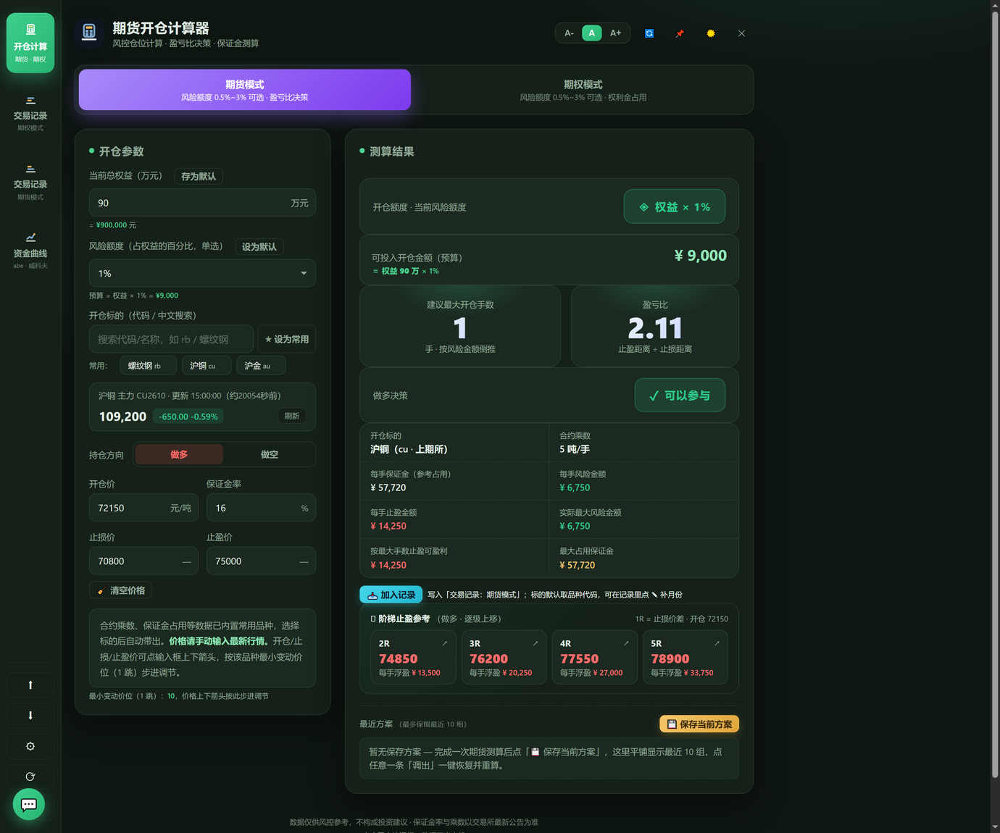
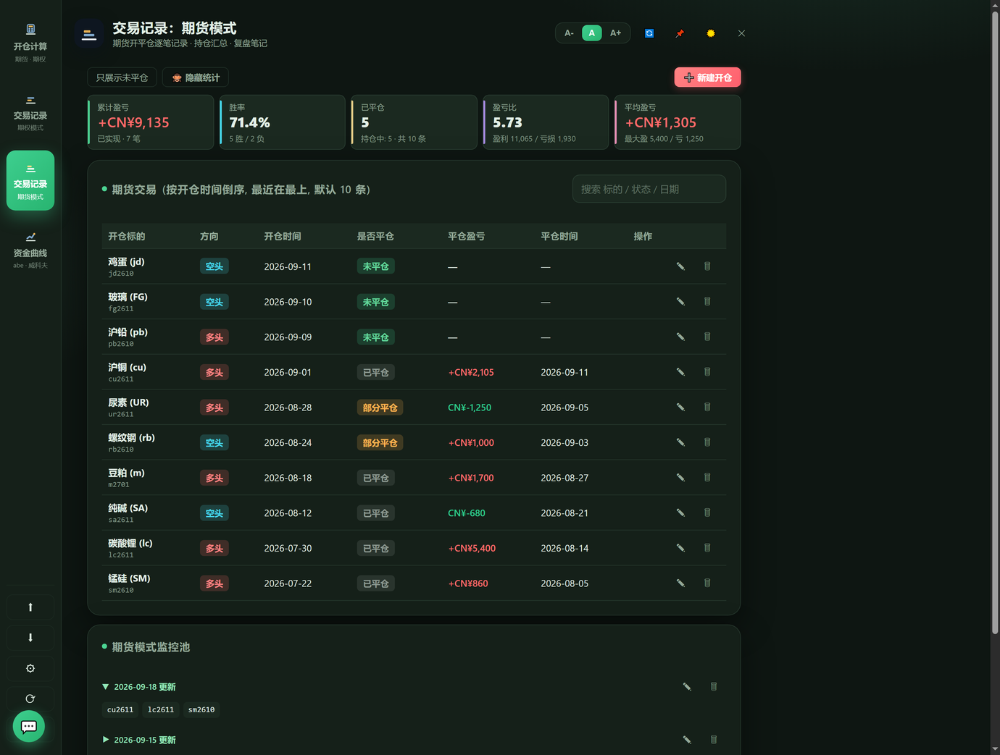
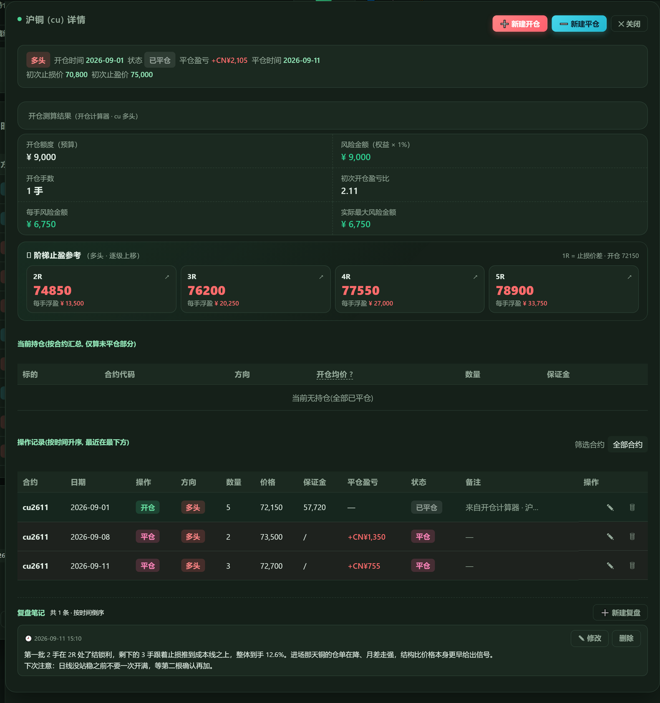
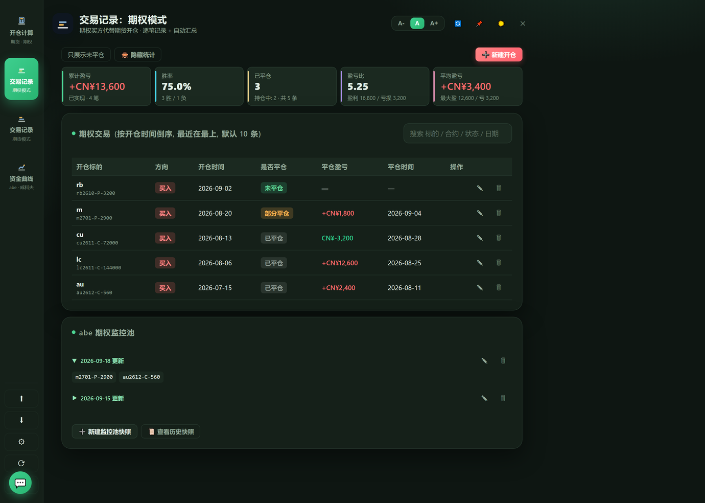
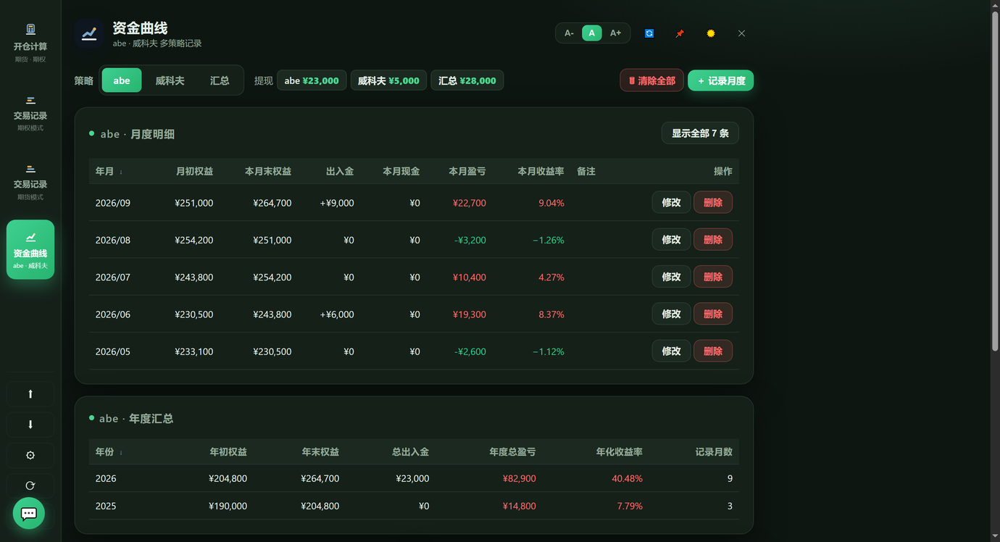
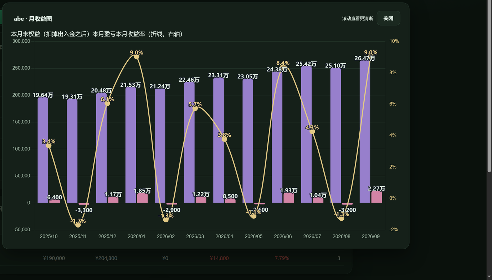

# 期货开仓计算器 (OpenCalc)

本地运行的**期货 / 期权开仓风控 · 交易记录 · 资金曲线**工具。零第三方依赖、双击即用，数据只存本机，不经过任何服务器。

## ✨ 主要功能

### 🧮 开仓计算器



- 期货 / 期权两个模式，参数各自独立
- 风险额度 0.5% / 1% / 1.5% / 2% / 3%（默认期货 1%、期权 3%），可设为默认
- 期货手数 = 开仓预算 ÷ 每手风险（止损价差 × 乘数）；保证金只作参考展示
- 期权买方：权利金全额占用、不占保证金；开仓价 = 1 手价格（已含乘数）
- 盈亏比决策：止盈距离 ÷ 止损距离，低于 1.5 提示不参与；手数不足 1 手直接判「不开仓」
- 🪜 **阶梯止盈参考**：以止损价差为 1R，给出 2R~5R 逐级止盈价（按最小变动价位取整，挂单可直接成交）与每档浮盈
- 内置 **75 个品种**的合约乘数 + 最小变动价位；价格按 1 跳步进并校验整数倍
- 最近方案：期货 / 期权各存最近 10 组，一键调出重算；卡片右侧 ✕ 可单条删除（删除前二次确认）
- 📥 **加入记录**：把当前参数 + 测算结果一键写入交易记录

### 📋 交易记录（期权模式 / 期货模式两个入口，数据互相隔离）



- 主表按**「标的 + 批次」**聚合，同品种多次开仓各自成一条：方向 / 开仓时间 / 是否平仓 / 平仓盈亏 / 平仓时间；默认显示 10 条，可展开全部
- **顶部战绩卡**：累计盈亏 / 胜率 / 已平仓（附持仓中）/ 盈亏比 / 平均盈亏 —— 口径是主表每条记录（一条 = 一笔），可一键隐藏并记住选择
- 搜索框：匹配 标的 / 合约 / 方向 / 状态 / 日期 / 盈亏，多个关键词空格分隔 = 全部命中
- 右侧详情：持仓汇总（只算未平仓部分的加权均价）+ 操作记录（备注、合约筛选、修改、删除），FIFO 扣减
- 平仓数量超额即时拦截；每条记录的详情内容（状态、盈亏、操作、复盘）**完全独立**，不与其他记录掺和
- 期货模式专属：初次止损 / 止盈、开仓测算结果卡、阶梯止盈方块
- **复盘笔记**：两个模式都有，归属跟着「这条记录」走（同品种别的记录看不到）
- 监控池快照（两个模式分开），保留历史可查

点开任意一条记录，右侧浮出**这一条自己的**详情 —— 状态 / 持仓 / 操作记录 / 测算结果 / 复盘互不干扰：



期权模式入口是一套同样的界面，标的为期权合约（如 `lc2611-C-144000`）：



### 📈 资金曲线



- 月度明细 / 年度汇总；月盈亏 = 月末权益 − 月初权益 + 出入金（出金为正）
- 多策略（abe / 威科夫）+ 汇总视图（缺失月份用最近月末延续）
- 累计提现卡片（各策略 + 汇总）、图表可点击放大
- 数据变动自动备份（保留最近 10 份）+ 一键恢复到某个时刻

图表点「⤢ 放大」可以铺满屏幕看细节：



### 🧰 通用
- 深色 / 浅色主题；界面字号 小 / 中 / 大（全站跟随）
- 窗口置顶；默认占屏幕左半屏
- 备份导出 / 导入（`.opcalc`）跨电脑迁移；数据目录可自定义，落在软件目录内会亮红点并支持一键迁出
- ⟳ 检查更新：启动静默检查，有新版本亮红点，可选下载 / 备份当前版本

## 🚀 快速开始

**直接运行（推荐）**：下载 `dist/OpenCalc.exe` 双击即可（Windows 10/11，无需任何环境）。

**源码运行**（需 Python 3.8+，仅标准库）：

```bash
python main.py
```

**自己打包 exe**：

```bash
pip install pyinstaller
pyinstaller --onefile --windowed --name OpenCalc --icon icon.ico \
  --add-data "icon.ico;." --add-data "chart.min.js;." \
  --add-data "assets/qrcode-wechat.png;assets" --add-data "assets/qrcode-alipay.png;assets" \
  main.py
```

## 📁 数据存储

数据目录查找顺序（前面的优先）：`OC_DATA_DIR` 环境变量 → 配置里的 `data_dir` → 默认 `%APPDATA%\OpenCalc\data`。

| 内容 | 路径 |
|---|---|
| 资金曲线 + 期货/期权交易记录 + 监控池 + 复盘（主库） | `<数据目录>\funds.db` |
| 自动备份快照（最近 10 份） | `<数据目录>\backup\funds_<时间戳>.db` |
| 用户设置（默认权益 / 风险额度 / 常用标的） | `%APPDATA%\OpenCalc\config.json` |
| 计算器「最近方案」 | 浏览器 localStorage（随 `.opcalc` 一起打包） |

> ⚠️ **建议把数据目录设在软件目录之外**（如网盘同步文件夹）。放在软件自己的文件夹里，更新软件时会跟着被删 —— 启动检测到会亮红点提醒并提供一键迁出。

| | `.db` 自动备份 | `.opcalc` 手动导出 |
|---|---|---|
| 产生方式 | 每次增删改自动存 | 点「⬆ 导出」生成 |
| 用途 | 本机退回某个时刻 | 换电脑 / 长期存档 |
| 恢复方式 | 「⚙ 数据位置」→ 备份列表 → 恢复 | 侧栏「⬇ 导入备份」 |
| 内容 | 整库 | 资金曲线 + 期货/期权交易记录 + 监控池 + 复盘 + 最近方案 |

> 备份完整性有专门的往返验证脚本：`python tools/backup_roundtrip.py`（起两个临时库，导出→导入→逐表核对，不碰真实数据）。

## 🧪 测试

```bash
python tests.py                    # 后端自动化测试（跑在临时库上，不碰真实数据）
node oc_cdp_test.js                # 前端 UI 全流程回归（需用 OC_DATA_DIR 指向测试目录启动服务，脚本会自检）
python tools/backup_roundtrip.py   # 备份往返验证（两个临时库，导出→导入→逐表核对）
```

> 想重新生成上面那几张功能截图：见 [`tools/README.md`](tools/README.md)（用临时库 + 演示数据，不碰真实记录）。

## 🔄 发版（维护者）

「检查更新」读的是仓库 `main` 分支的 `version.json`，发版三步：

1. 改 `main.py` 的 `APP_VERSION`（整数，比用户本机大才会提示更新）
2. 更新 `version.json`：`version` / `version_name` / `date` / `url` / `sha256` / `notes`
   - `sha256` 留空则不校验；填了必须完全匹配（重新打包后要重算）
   - `url` 填相对路径时按 `https://raw.githubusercontent.com/zxcools/OpenCalc/main/` 拼接
3. 打包并把 `dist/OpenCalc.exe` 一起提交推送 —— **`version.json` 与 exe 必须同时是最新的**

## ⚠️ 免责声明

本工具仅供个人风控参考，不构成任何投资建议。保证金率、合约乘数以交易所最新公告为准。

## 💬 联系作者

- 知乎：[假装很稳定](https://www.zhihu.com/people/zhang-xu-11-6-63)
- 软件左下角 💬 按钮内有支持方式（微信 / 支付宝）

---

## 📦 更新日志

> 按天记录，一天内的多次改动合并为一条。

### 2026-09-23（v50.58）
- 🗑 **最近方案支持删除**：卡片右侧新增 ✕（期货 / 期权两个模式都有），点一下删掉这一条并写回本地存储，删除前二次确认；点 ✕ 不会误触发「调出」

### 2026-09-21（v50.57）
- 📝 **期权交易记录也能写复盘笔记**了，和期货各记各的（同标的同批次也不串）
- 📐 **交易记录弹窗里的价格按品种最小变动价位步进**：开仓价 / 止损价 / 止盈价 / 平仓价的上下箭头跟着合约 tick 走（之前写死 0.0001，跟品种无关）
- 💾 **备份把计算器「最近方案」也打包进去**（两个模式各 10 组，之前只存本机、换电脑会丢）
- 🔍 备份按钮提示补全：导出/导入覆盖 资金曲线 + 期货/期权交易记录 + 监控池 + 复盘 + 最近方案

### 2026-09-18（v50.53 ~ v50.56）
- 📊 **交易记录顶部战绩卡**：累计盈亏 / 胜率 / 已平仓（附持仓中）/ 盈亏比 / 平均盈亏；口径 = 主表每条记录（一条 = 一笔），不受搜索与筛选影响；5 张卡优先排一行，窄了自动降列
- 🗂 **详情页按「记录」彻底独立**：状态、盈亏、持仓、操作记录、测算结果、复盘笔记全部只属于当前这一条，同品种别的记录不再串数据
- 📝 **复盘笔记跟着记录走**：不再按品种共用，A 条里写的复盘 B 条看不到
- 👁 **新增「隐藏统计」开关**：收起战绩卡腾空间，选择会记住；「只展示未平仓」改成同款按钮样式
- 🔤 资金曲线「累计提现」字号与同行一致，并跟随字号设置缩放
- 🐞 修复：有持仓却「1 手都平不了」 / 期货监控池跑到期权模式 / 主页新建开仓被吞进旧记录 / 备份丢数据（期货监控池、复盘笔记）/ 工具栏按钮错位
- 📸 README 补上各功能界面截图（计算器 / 交易记录 / 记录详情 / 期权模式 / 资金曲线 / 图表放大）

### 2026-09-16 ~ 09-17（v50.40 ~ v50.52）
- ⟳ 新增「检查更新」（静默检查、红点提示、可选下载与备份当前版本）；测算结果改两列
- 期货模式全面完善：标的显示中文名、手填开仓合约、操作记录筛选合约、平仓超额即时拦截、复盘笔记可修改、阶梯止盈改方块
- 修复：期货模式表头与数据行错位、并发下 sqlite 报错、改开仓合约丢测算结果、备份导入丢字段

### 2026-09-15（v50.36 ~ v50.39）
- 「显示全部」展开后不再撑高页面（容器内滚动 + 表头吸顶）
- 修复「显示全部」按钮 id 冲突导致完全失效
- 期权模式也能保存方案（两模式各 10 组）
- 逐个核对交易所公告，修正 6 个品种的最小变动价位

### 2026-09-12（v50.33 ~ v50.35）
- 交易记录主表搜索框；全套图标换新；版本号与 README 对齐

### 2026-09-10 ~ 09-11（v50.28 ~ v50.32）
- **数据安全专项**：数据不许落在软件目录内（亮红点 + 一键迁出）、每次变动自动备份 10 份 + 一键恢复
- 修复备份导入丢交易记录；修复「数据位置 → 浏览」没反应（改内置文件夹浏览器）
- 合约代码规范写法（大小写归一）+ 分隔式合约自动识别看涨看跌

### 2026-09-09 及更早（v49 ~ v50.27）
- 阶梯止盈参考（1R~5R）；交易记录 tab + 完整增删改查；策略名自定义
- 详情布局：主表 + 右侧分页同屏可见；侧栏重排版；窗口居左固定
